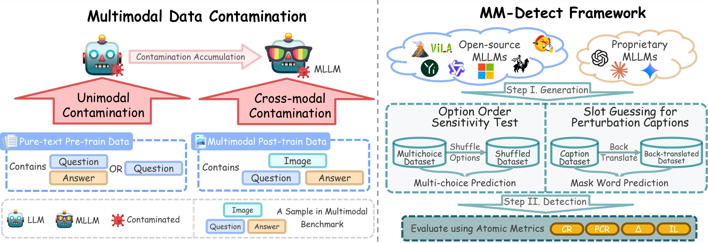

<div align="center">
  
# 🕵️ MM-Detect: The First Multimodal Data Contamination Detection Framework

[](https://arxiv.org/abs/2411.03823)
[](https://huggingface.co/papers/2411.03823#community)
[](https://2025.emnlp.org/)
[](https://icml2025digbugs.github.io/)
[](LICENSE)
[](https://www.python.org/downloads/)

**Authors:** Dingjie Song*, Sicheng Lai*, Shunian Chen, Lichao Sun, Benyou Wang

*A systematic framework for detecting data contamination in Multimodal Large Language Models*

</div>

---

## 📋 Table of Contents

- [🏆 Latest Updates](#-latest-updates)
- [🔍 Overview](#-overview)
- [⚡ Quick Start](#-quick-start)
  - [Prerequisites](#prerequisites)
  - [Installation](#installation)
- [🚀 Usage Guide](#-usage-guide)
  - [Supported Models](#supported-models)
  - [Configuration](#configuration)
  - [Running Detection](#running-detection)
- [🔬 Contamination Source Analysis](#-contamination-source-analysis)
- [📊 Datasets](#-datasets)
- [🔧 Troubleshooting](#-troubleshooting)
- [📝 Citation](#-citation)
- [🙏 Acknowledgements](#-acknowledgements)

---

## 🏆 Latest Updates

- **[August 2025]** 🎉 Paper accepted to [EMNLP 2025](https://2025.emnlp.org/) **Findings** track
- **[June 2025]** 🏆 Paper accepted to [ICML 2025 DIG-BUG Workshop](https://icml2025digbugs.github.io/) as **oral presentation**

---

## 🔍 Overview

<div align="center">
  
  <p><em>MM-Detect framework for multimodal data contamination detection</em></p>
</div>

The rapid advancement of **Multimodal Large Language Models (MLLMs)** has achieved remarkable performance across various benchmarks. However, **data contamination** during training poses significant challenges for fair evaluation and model comparison.

### 🎯 Key Challenges
- Existing contamination detection methods for LLMs are **insufficient for MLLMs**
- Multiple modalities and training phases complicate detection
- Need for systematic analysis of contamination sources

### 💡 Our Solution: MM-Detect
**MM-Detect** introduces the first comprehensive framework specifically designed for detecting data contamination in multimodal models:

✅ **Multi-modal Detection**: Handles both text and image contamination  
✅ **Multi-phase Analysis**: Identifies contamination across different training stages  
✅ **Heuristic Source Identification**: Determines if contamination originates from LLM pre-training  
✅ **Comprehensive Model Support**: Works with white-box, grey-box, and black-box models  

---

## ⚡ Quick Start

### Prerequisites

<details>
<summary><strong>📋 System Requirements</strong></summary>

- **Operating System**: Linux (Ubuntu 18.04+), macOS, or Windows with WSL
- **Python**: 3.10 or higher
- **Package Manager**: conda + Poetry (automatically installed via environment.yml)
- **Java**: OpenJDK 11+ (automatically installed via environment.yml)
- **GPU**: NVIDIA GPU with CUDA support (recommended for faster inference)
- **Memory**: Minimum 16GB RAM, 32GB+ recommended

</details>

### Installation

#### 🚀 Quick Setup (Recommended)
```bash
# 1. Clone the repository
git clone https://github.com/MLLM-Data-Contamination/MM-Detect.git
cd MM-Detect

# 2. Create and activate conda environment (includes Python 3.10, Poetry, and Java)
conda env create -f environment.yml
conda activate MM-Detect

# 3. Install Python dependencies with Poetry
poetry install --no-root
```

#### 📋 Manual Installation (Alternative)

<details>
<summary><strong>Click to expand manual installation steps</strong></summary>

#### 1️⃣ Clone the Repository
```bash
git clone https://github.com/MLLM-Data-Contamination/MM-Detect.git
cd MM-Detect
```

#### 2️⃣ Create Python Environment
```bash
# Using conda (recommended)
conda create -n MM-Detect python=3.10
conda activate MM-Detect

# Or using virtualenv
python -m venv MM-Detect
source MM-Detect/bin/activate  # On Windows: MM-Detect\Scripts\activate
```

#### 3️⃣ Install Poetry
```bash
# Install Poetry
pip install poetry

# Install dependencies
poetry install --no-root
```

#### 4️⃣ Install Java (for Stanford POS Tagger)
```bash
# Ubuntu/Debian
sudo apt update
sudo apt install openjdk-11-jdk

# CentOS/RHEL
sudo yum install java-11-openjdk-devel

# macOS
brew install openjdk@11

# Verify installation
java -version
```

</details>

---

## 🚀 Usage Guide

### Supported Models

<div align="center">

| **Model Type** | **Access Level** | **Models Supported** |
|:-------------:|:---------------:|:---------------------|
| 🔓 **White-box** | Full Access | LLaVA-1.5, VILA1.5, Qwen-VL-Chat, idefics2, Phi-3-vision-instruct, Yi-VL, InternVL2, DeepSeek-VL2 |
| 🔒 **Grey-box** | Partial Access | fuyu |
| ⚫ **Black-box** | API Only | GPT-4o, Gemini-1.5-Pro, Claude-3.5-Sonnet |

</div>

### Configuration

#### 🔑 API Configuration (Black-box Models)

**Step 1: Create environment file**
```bash
# Copy the example environment file
cp .env.example .env
```

**Step 2: Configure your API keys**
Edit the `.env` file with your API credentials:

```bash
# OpenAI API Configuration
OPENAI_API_KEY=your_actual_openai_api_key_here
OPENAI_BASE_URL=https://api.openai.com/v1

# Google Gemini API Configuration  
GEMINI_API_KEY=your_actual_gemini_api_key_here

# Anthropic Claude API Configuration
ANTHROPIC_API_KEY=your_actual_anthropic_api_key_here
```

**Step 3: Verify configuration**
The framework will automatically load these credentials when running detection tests.

<details>
<summary><strong>🔒 Security Best Practices</strong></summary>

- ✅ **Never commit** your `.env` file to version control
- ✅ **Keep API keys secure** and rotate them regularly  
- ✅ **Use environment-specific** `.env` files for different deployments
- ✅ **Set appropriate permissions** on your `.env` file: `chmod 600 .env`
- ✅ **Monitor API usage** to detect unauthorized access

</details>

#### 💾 Output Configuration (Optional)
Configure output settings in your `.env` file:

```bash
# Output Configuration
OUTPUT_DIR=./outputs
RESULTS_FILE=./outputs/results.json
ENABLE_RESUME=true

# Model Configuration (Optional)
DEFAULT_MODEL=gpt-4o
MAX_TOKENS=4096
TEMPERATURE=0.7
```

The framework will automatically:
- ✅ Create output directories
- ✅ Save results to specified locations
- ✅ Enable resume functionality when interrupted

### Running Detection

#### 🧪 Basic Example: Option Order Sensitivity Test

```bash
# Test GPT-4o on ScienceQA dataset
bash scripts/mllms/option_order_sensitivity_test/test_ScienceQA.sh -m gpt-4o

# Test LLaVA-1.5 on MMStar dataset  
bash scripts/mllms/option_order_sensitivity_test/test_MMStar.sh -m llava-1.5

# Resume interrupted tests with -r flag
bash scripts/mllms/option_order_sensitivity_test/test_ScienceQA.sh -m gpt-4o -r
```

#### 🔄 Resume Functionality

MM-Detect includes intelligent resume capabilities to handle interrupted runs:

**Automatic Checkpointing:**
- ✅ **Progress saved every 10 items** processed
- ✅ **Checkpoint files** stored in `outputs/checkpoints/`
- ✅ **Failed items tracking** with error details
- ✅ **Automatic cleanup** after successful completion

**Using Resume:**
```bash
# Add -r flag to resume from last checkpoint
bash scripts/mllms/option_order_sensitivity_test/test_ScienceQA.sh -m gpt-4o -r
bash scripts/mllms/option_order_sensitivity_test/test_MMStar.sh -m claude-3.5-sonnet -r

# Or use --resume directly with main.py
python main.py --method option-order-sensitivity-test --model_name gpt-4o --resume
```

**Resume Information:**
When resuming, you'll see detailed progress information:
```
🔄 Resuming from checkpoint:
   Task ID: a1b2c3d4e5f6
   Method: option_order_sensitivity_test
   Model: gpt-4o
   Dataset: derek-thomas/ScienceQA
   Progress: 450/1340 (33.6%)
   Failed items: 2
   Last saved: 2024-08-08 14:30:15
```

#### 🔬 Advanced Usage Examples

<details>
<summary><strong>📊 Batch Testing Multiple Models</strong></summary>

```bash
# Test multiple models on the same dataset
models=("gpt-4o" "claude-3.5-sonnet" "gemini-1.5-pro")
for model in "${models[@]}"; do
    echo "Testing $model..."
    bash scripts/mllms/option_order_sensitivity_test/test_ScienceQA.sh -m "$model"
done
```

</details>

<details>
<summary><strong>🎯 Custom Dataset Testing</strong></summary>

```bash
# Modify the script to use your custom dataset
# Edit the dataset path in the corresponding test script
# Then run the detection
bash scripts/mllms/option_order_sensitivity_test/custom_test.sh -m your-model
```

</details>

---

## 🛠️ Development

### Adding Dependencies
```bash
# Add a new runtime dependency
poetry add package-name

# Add a new development dependency
poetry add --group dev package-name

# Update dependencies
poetry update
```

### Project Structure
```
MM-Detect/
├── pyproject.toml          # Poetry configuration and dependencies
├── environment.yml         # Conda environment specification
├── .env.example            # Template for environment variables
├── .env                    # Your API keys (create from .env.example)
├── mm_detect/              # Main package directory
│   ├── utils/              # Utility modules
│   │   ├── config.py       # Configuration and API key management
│   │   └── resume_manager.py # Resume functionality
│   └── mllms/              # Model implementations
├── scripts/                # Test and run scripts
├── outputs/                # Results and checkpoints
│   ├── checkpoints/        # Resume checkpoint files
│   └── results.json        # Final results
└── requirements.txt        # Legacy (for compatibility)
```

---

## 🔬 Contamination Source Analysis

Determine whether contamination originates from the **pre-training phase** of base LLMs:

### Supported LLMs for Source Analysis

| **Model Family** | **Specific Models** |
|:---------------:|:-------------------|
| **LLaMA** | LLaMA2-7B, LLaMA2-13B |
| **Qwen** | Qwen-7B, Qwen-14B |
| **InternLM** | Internlm2-7B, Internlm2-20B |
| **Mistral** | Mistral-7B-v0.1 |
| **Phi** | Phi-3-instruct |
| **Yi** | Yi-6B, Yi-34B |
| **DeepSeek** | DeepSeek-MoE-Chat |

### Running Source Analysis

```bash
# Analyze Qwen-7B on MMStar dataset
bash scripts/llms/detect_pretrain/test_MMStar.sh -m Qwen/Qwen-7B

# Analyze LLaMA2-7B
bash scripts/llms/detect_pretrain/test_MMStar.sh -m meta-llama/Llama-2-7b-hf

# Batch analysis for multiple models
for model in "Qwen/Qwen-7B" "meta-llama/Llama-2-7b-hf" "mistralai/Mistral-7B-v0.1"; do
    echo "Analyzing contamination source for $model..."
    bash scripts/llms/detect_pretrain/test_MMStar.sh -m "$model"
done
```

---

## 📊 Datasets

MM-Detect supports comprehensive evaluation across multiple benchmark datasets:

<div align="center">

| **Dataset** | **Type** | **Domain** | **Size** | **Description** |
|:-----------:|:--------:|:----------:|:--------:|:---------------|
| [**ScienceQA**](https://huggingface.co/datasets/derek-thomas/ScienceQA) | VQA | Science | 21K | Science question answering with diagrams |
| [**MMStar**](https://huggingface.co/datasets/Lin-Chen/MMStar) | VQA | General | 1.5K | Multi-domain visual question answering |
| [**COCO-Caption**](https://huggingface.co/datasets/lmms-lab/COCO-Caption2017) | Captioning | General | 123K | Image captioning benchmark |
| [**NoCaps**](https://huggingface.co/datasets/lmms-lab/NoCaps) | Captioning | General | 166K | Novel object captioning |
| [**Vintage**](https://huggingface.co/datasets/SilentAntagonist/vintage-artworks-60k-captioned) | Captioning | Art | 60K | Vintage artwork descriptions |

</div>

---

## 🔧 Troubleshooting

<details>
<summary><strong>🐛 Common Issues and Solutions</strong></summary>

### Issue 1: `googletrans` AttributeError
```python
AttributeError: module 'httpcore' has no attribute 'SyncHTTPTransport'
```
**Solution:** 
- Install compatible versions: `pip install httpx==0.27.2 googletrans==3.1.0a0`
- Alternative: Use the solution from [Stack Overflow](https://stackoverflow.com/questions/72796594/attributeerror-module-httpcore-has-no-attribute-synchttptransport)

### Issue 2: Java Not Found
```bash
Exception: Java not found. Please install Java to use Stanford POS Tagger.
```
**Solution:**
```bash
# Check Java installation
java -version

# If not installed, install OpenJDK 11
sudo apt install openjdk-11-jdk  # Ubuntu/Debian
brew install openjdk@11         # macOS
```

### Issue 3: CUDA Out of Memory
```python
torch.cuda.OutOfMemoryError: CUDA out of memory
```
**Solution:**
- Reduce batch size in configuration files
- Use gradient checkpointing: `--gradient_checkpointing`
- Switch to CPU inference: `--device cpu`

### Issue 4: API Rate Limiting
```python
openai.error.RateLimitError: Rate limit exceeded
```
**Solution:**
- Add delays between API calls
- Use multiple API keys
- Consider using local models instead

</details>

<details>
<summary><strong>📧 Getting Help</strong></summary>

If you encounter issues not covered above:

1. **Check Issues**: Search [existing issues](https://github.com/MLLM-Data-Contamination/MM-Detect.git/issues)
2. **Create Issue**: Open a [new issue](https://github.com/MLLM-Data-Contamination/MM-Detect.git/issues/new) with:
   - Error message
   - System information
   - Steps to reproduce
3. **Community Support**: Join our discussions for community help

</details>

---

## 📝 Citation

If you find MM-Detect helpful in your research, please consider citing our work:

```bibtex
@misc{song2025textimagesleakedsystematic,
      title={Both Text and Images Leaked! A Systematic Analysis of Data Contamination in Multimodal LLM}, 
      author={Dingjie Song and Sicheng Lai and Mingxuan Wang and Shunian Chen and Lichao Sun and Benyou Wang},
      year={2025},
      eprint={2411.03823},
      archivePrefix={arXiv},
      primaryClass={cs.CV},
      url={https://arxiv.org/abs/2411.03823}, 
}
```

---

## 🙏 Acknowledgements

We extend our gratitude to the following projects and contributors:

<div align="center">

| **Project** | **Contribution** | **Link** |
|:-----------:|:---------------:|:--------:|
| **LLaVA** | Multimodal architecture inspiration | [GitHub](https://github.com/haotian-liu/LLaVA) |
| **LLMSanitize** | Contamination detection methodologies | [GitHub](https://github.com/ntunlp/LLMSanitize) |
| **Stanford POS Tagger** | Natural language processing tools | [Official](https://nlp.stanford.edu/software/tagger.shtml) |

</div>

### Special Thanks
- The research community for valuable feedback and suggestions
- Contributors who helped improve the framework
- Beta testers who provided essential bug reports
